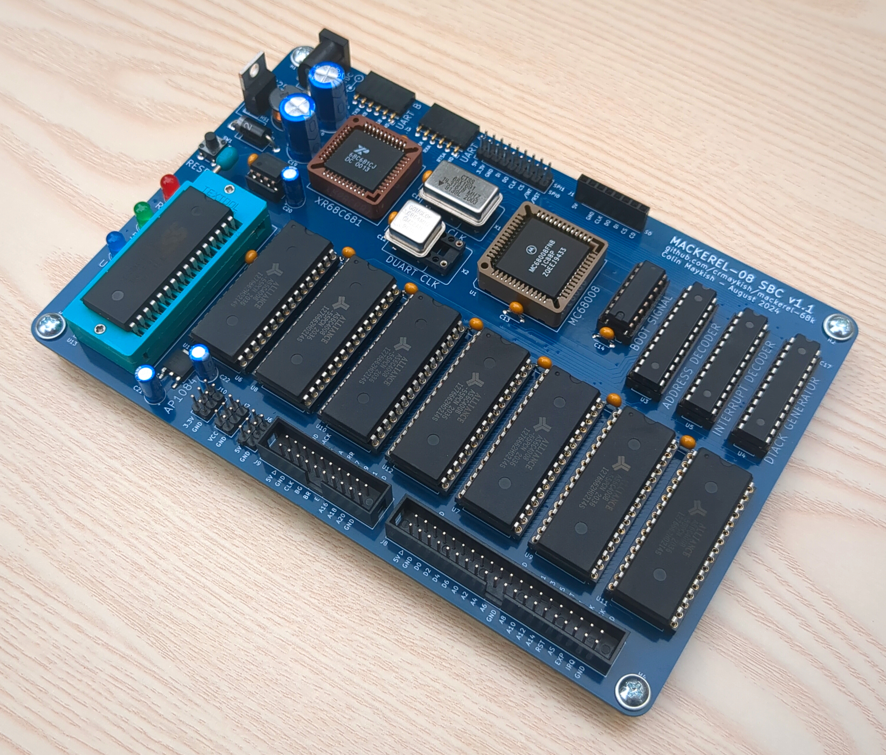
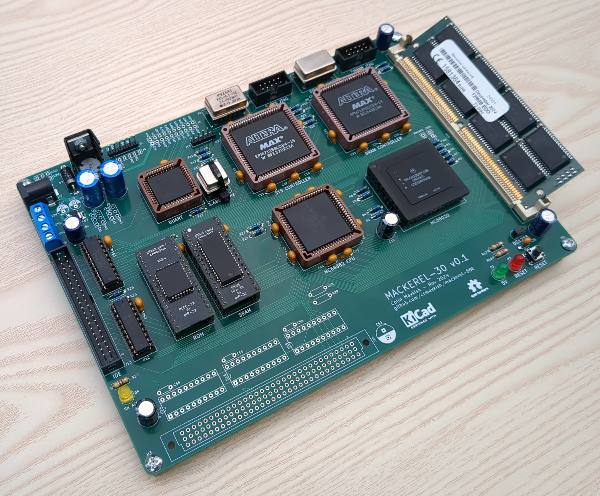
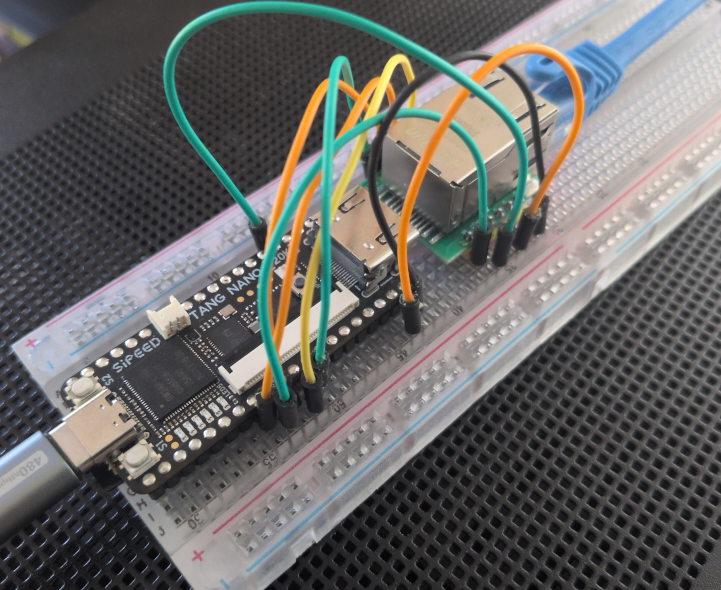

# Mackerel 68k

Mackerel 68k is a family of homebrew single-board computers built around the Motorola 68000 line of processors plus a from-scratch effort to run **mainline Linux** on each one.

The project works its way up the 68k family one chip at a time, from the 68008 to the 68040. Each new board adds capability: more memory, faster CPUs, an FPU, an MMU, and richer peripherals. But the throughline is software - every Mackerel runs the **latest mainline Linux kernel**, from a tiny NOMMU uClinux shell on the 68008 up to a full MMU + hardware-FPU install on the 68030.

What's in the box, top to bottom:

- **Bespoke hardware** - custom PCBs with programmable logic chips (22V10 GALs on the 68008, Altera CPLDs on the later boards) handling address decoding, DRAM control, and interrupts.
- **A homegrown bootloader** - a small ROM monitor on every board with debug tools (peek, poke, memtest), YMODEM file transfer, and the ability to boot Linux from IDE or SD.
- **Custom toolchains** - bare-metal and Linux (MMU + NOMMU) GCC cross-compilers built with crosstool-ng.
- **Mainline Linux** - kernel port with drivers for the DUART, IDE storage, and Ethernet-over-SPI, booting to a BusyBox userspace.
- **Fully open source** - every schematic, PCB layout, logic file, and line of code is open, and hobbyists around the world have built their own Mackerel boards.

Three discrete boards are running today (68008, 68010, and 68030), with a 68040 system in the works - plus Mackerel-F, an FPGA build that runs a full Mackerel system on a soft 68000 core.

## Links

1. [Hackaday Project Page](https://hackaday.io/project/183861-mackerel-68k-computer)
2. [Mackerel Linux v7.1.x](https://github.com/crmaykish/mackerel-linux/tree/mackerel)
3. [Mackerel uClinux (deprecated)](https://github.com/crmaykish/mackerel-uclinux-20160919)

## Docs

1. [Mackerel-08 Assembly](docs/mackerel-08-board-assembly.md)
2. [How to Compile Code and Programmable Logic](docs/how-to-compile-everything.md)
3. [Building the Mackerel Toolchains](docs/building-the-mackerel-toolchains.md)
4. [Building and Booting Linux on Mackerel](docs/building-linux-for-mackerel.md)
5. [Building and Running Mackerel-F (FPGA)](docs/building-and-running-mackerel-f.md)

## Hardware

### Mackerel-08

Status: Complete

- MC68008 CPU (52-pin PLCC variant)
- 512 KB of Flash ROM, 3.5MB SRAM
- Two serial ports
- SD card support (bitbang SPI)
- Linux 7.1.x NOMMU

Based on the original prototype hardware, this SBC combines the 52-pin PLCC MC68008, a 512KB Flash ROM, up to 3.5MB of SRAM, and a XR68C681 DUART on a single PCB. The DUART exposes two serial ports and three bit-banged SPI headers. One of these headers is currently used with an SD card breakout board to provide bulk storage.

Three 22V10 PLDs are used for address decoding, interrupt mapping, and DTACK generation. An expansion header breaks out address, data, and control lines to allow additional peripherals to be connected directly to the processor bus.

The address space is mapped as follows:

- RAM:    0x000000 - 0x37FFFF (up to 3.5 MB)
- ROM:    0x380000 - 0x3FBFFF (496/512 KB usable)
- DUART:  0x3FC000 - 0x3FDFFF (8KB)
- Exp:    0x3FE000 - 0x3FFFFF (Expansion header, 8KB)

Mackerel-08 uses a 74HC595 shift register to create a BOOT signal for the first eight /AS cycles of the CPU after reset. This BOOT signal is used by the address decoder PLD to map the ROM to address 0x000000 long enough for the CPU to read the initial stack pointer and program counter vectors from ROM. RAM is mapped to 0x000000 after that.

### Mackerel-10

Status: Complete

- MC68000 or MC68010 CPU
- 1 MB of ROM, 1 MB of SRAM
- Up to 16 MB of 30-pin DRAM (15 usable)
- Two serial ports
- IDE interface
- Linux 7.1.x NOMMU

Mackerel-10 is the second SBC in the project. It expands on the design of Mackerel-08 with a MC68010 CPU (or equivalent), the same XR68C681 DUART, 1MB of Flash ROM, 1MB of SRAM, up to 16 MB of DRAM, and an IDE drive interface. Two CPLDs act as the glue logic and DRAM controller for the board. The SRAM is optional and the address space can be filled almost entirely with DRAM.

The memory map looks like this:

- DRAM:     0x000000 - 0xEFFFFF (15MB)
- ROM:      0xF00000 - 0xFF4000 (not quite 1MB)
- I/O:      0xF40000 - 0xFFFFFF

### Mackerel-30

Status: Prototype

- MC68030 CPU at 20 MHz
- MC68882 FPU
- 512 KB ROM, 512 KB SRAM
- 128 MB of 72-pin DRAM
- Two serial ports
- IDE interface
- Ethernet over SPI
- Linux 7.1.x

Mackerel-30 is based on the 68030 CPU. It includes the DUART and IDE interface from Mackerel-10 and upgrades the DRAM controller to use a 72-pin SIMM. It also includes a MC68882 FPU.

### Mackerel-40
Status: Design

- 68040 CPU at 33 MHz (internal MMU and FPU)
- 2 MB of ROM, 2 MB SRAM
- 2x72 pin SIMMs (up to 256 MB of DRAM)
- Dedicated I/O controller (SPI, I2C, GPIO)
- DUART and IDE from earlier boards

### Mackerel-F

Status: Prototype (FPGA)

- fx68k soft 68000 core at 37.8 MHz, in a Tang Nano 20k
- 8 MB SDRAM
- 30 KB ROM (bootloader) and 32 KB BSRAM
- UART console, programmable timer, and interrupt controller
- microSD (SPI) and W5500 Ethernet
- Linux 7.1.x NOMMU

Mackerel-F is an entire Mackerel system implemented inside an FPGA. Everything that is discrete hardware on the other boards - the CPU, glue logic, memory controller, UART, timer, interrupt controller, and SPI masters - is RTL here, built around the [fx68k](https://github.com/ijor/fx68k) soft 68000 core and synthesized for the Tang Nano 20k. The SoC runs at 75.6 MHz with the 68000 core clocked at half that (37.8 MHz).

Unlike the other boards there is no separate ROM chip: the bootloader is baked into the FPGA bitstream as on-chip ROM and its scratch RAM lives in block RAM, so the entire 8 MB of SDRAM is free for Linux. Alongside the usual `boot` (from SD) and YMODEM transfer, the bootloader adds a `netboot` command that pulls the kernel over Ethernet (raw TCP, with a small host server) and a five-second SD autoboot.

The memory map:

- RAM:    0x000000 - 0x7FFFFF (8 MB SDRAM, the top 384 KB holds the execute-in-place root filesystem)
- BSRAM:  0xFF0000 - 0xFF7FFF (32 KB, bootloader RAM)
- ROM:    0xFF8000 - 0xFFF7FF (30 KB, bootloader ROM)
- I/O:    0xFFF800 - 0xFFFFFF (GPIO, UART, timer, two SPI masters, interrupt controller)

It boots mainline NOMMU uClinux to a BusyBox shell from a ROMfs root run in place from SDRAM, with the microSD for storage and the W5500 for networking. See [Building and Running Mackerel-F (FPGA)](docs/building-and-running-mackerel-f.md).

## Software

### Bootloader and Bare-metal Programs
Every version of Mackerel runs a small bootloader program installed on the Flash ROM. This provides a simple set of debugging tools (peek, poke, memtest, etc.) as well as two methods for loading external code.

The bootloader supports the YMODEM protocol for loading programs and data into RAM (see the `ymodem` command), using `lrzsz-sb` on the PC for example. Other terminal programs like TeraTerm should also work.

The `boot` command is used to load the Linux kernel from disk (SD or IDE). It expects a `IMAGE.BIN` file on the first FAT16 partition of the drive. See the `prepare_disk.sh` script in the [mackerel-linux repository](https://github.com/crmaykish/mackerel-linux).

On Mackerel-F the bootloader also supports `netboot` (pulling the kernel over Ethernet) and a five-second SD autoboot on power-up.

### Linux on Mackerel

Every Mackerel board runs the latest mainline kernel (v7.1.x). Mackerel-08, Mackerel-10, and the FPGA-based Mackerel-F run NOMMU and are more limited in their capabilities. Mackerel-30 supports the MMU and the external FPU in Linux and functions more like a traditional headless Linux install. Userspace is made up of busybox (init and shell) with driver support for the DUART, IDE storage, and networking over SPI.

### Compilers and Tools
There are three different toolchains for Mackerel. The baremetal toolchain builds the bootloader and other low level programs in this repo. There are also two variants of the Linux toolchain - one for Mackerel-30 with MMU support and the other for NOMMU/ucLinux on Mackerel-08/10. Prebuilt toolchains are available on the [releases page](https://github.com/crmaykish/mackerel-68k/releases/tag/toolchains-2026-06-06); see [Building the Mackerel Toolchains](docs/building-the-mackerel-toolchains.md) for both the download steps and instructions on building them all with crosstools-ng.
