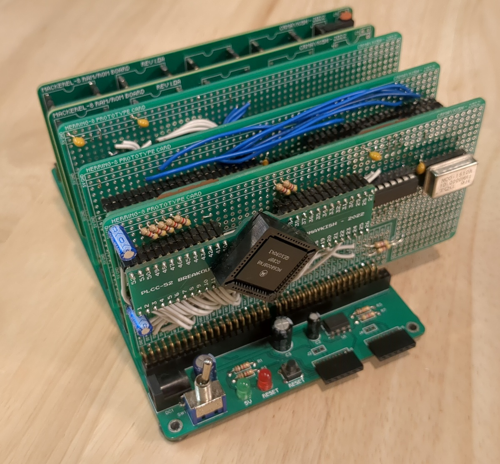
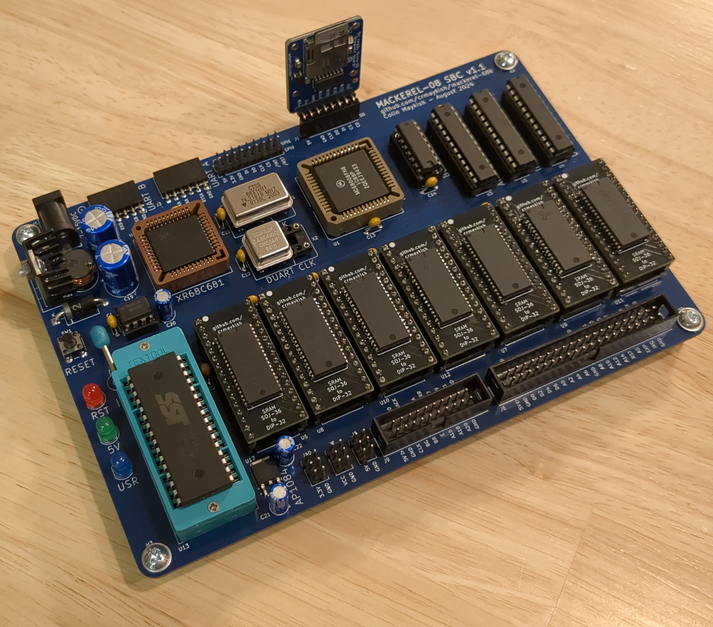

# Mackerel 68k SBC

Mackerel is a series of homebrew computers based on the Motorola 68000 series of processors. The first iteration uses the 8-bit variant, the MC68008. The goal of this project is to gradually work my way up the family tree, building systems based on the 68010, the 68020/30 and eventually the 68040, each time increasing the complexity of the hardware and improving the software support.

Mackerel-08 runs uClinux as will the Mackerel-10. The long-term goal is to run a modern kernel with MMU support on the 68030 and 68040.

See the [Hackaday Project Page](https://hackaday.io/project/183861-mackerel-68k-computer) for pictures, build logs, and more.

## Project Goals
These are the high-level goals of the Mackerel project. Each of these items is a major milestone in the project. My plan is not to rush through these, but to spend enough time on each iteration to really understand the hardware design and the software support.

- [x] Build a proof-of-concept computer with a 68008, ROM, RAM, and a serial port
- [x] Port uClinux 4.4
- [x] Mackerel-08: Design a 68008-based SBC
- [x] Mackerel-10: Upgrade CPU to 68010, add DRAM, IDE storage
- [ ] Mackerel-30: 68030 CPU at 25+ MHz, 64MB 72-pin DRAM, ethernet, Linux kernel v6 with MMU support
- [ ] Big Mack: 68040/68060 at 40+ MHz, 256MB DRAM, VGA video

## Hardware

### Prototype
The first few iterations of Mackerel started as protoboard cards connected to a passive backplane. Originally the 48-pin DIP package of the MC68008 was used, but this was quickly replaced with the 52-pin PLCC package for 4MB of address space. Once the hardware design was functional, PCB design for Mackerel-08 was started.

### Mackerel-08
Based on the original prototype hardare, this SBC combines the 52-pin PLCC MC68008, a 512KB Flash ROM, up to 3.5MB of SRAM, and a XR68C681 DUART on a single PCB. The DUART exposes two serial ports and three bit-banged SPI headers. One of these headers is currently used with an SD card breakout board to provide bulk storage.

Three 22V10 PLDs are used for address decoding, interrupt mapping, and DTACK generation. An expansion header breaks out address, data, and control lines to allow additional peripherals to be connected directly to the processor bus.

Although the 68008 is only rated to 8/10 MHz, the CPU runs reliably overclocked to 16 MHz.

The address space is mapped as follows:

- RAM:    0x000000 - 0x37FFFF (up to 3.5 MB)
- ROM:    0x380000 - 0x3FBFFF (496/512 KB usable)
- DUART:  0x3FC000 - 0x3DFFFF (8KB)
- Exp:    0x3FE000 - 0x3FFFFF (Expansion header, 8KB)

Mackerel-08 uses a 74HC595 shift register to create a BOOT signal for the first eight /AS cycles of the CPU after reset. This BOOT signal is used by the address decoder PLD to map the ROM to address 0x000000 long enough for the CPU to read the initial stack pointer and program counter vectors from ROM. RAM is mapped to 0x000000 after that.

### Mackerel-10
Mackerel-10 is the second SBC in the project. It expands on the design of Mackerel-08 with a MC68010 CPU (or equivalent), the same XR68C681 DUART, 1MB of Flash ROM, 1MB of SRAM, up to 16 MB of DRAM, and an IDE drive interface. Two CPLDs act as the glue logic and DRAM controller for the board. The SRAM is optional and the address space can be filled almost entirely with DRAM.

The memory map looks like this:

- DRAM:     0x000000 - 0xEFFFFF (15MB)
- ROM:      0xF00000 - 0xFF4000 (not quite 1MB)
- I/O:      0xF40000 - 0xFFFFFF

## Software

### Bootloader and Bare-metal Programs
Mackerel runs a small bootloader program installed on the Flash ROM. This provides a simple set of debugging tools (peek, poke, memtest, etc.) as well as two methods for loading external code into RAM.

The bootloader can load program data coming in over the serial port (`load` command) or it can read data from an SD card (`boot` command). Either way, the program code gets loaded into RAM at address 0x400 and then the bootloader jumps to that address to start the program.

### uClinux
Mackerel supports two versions of uClinux. [Version 2.0](https://github.com/crmaykish/mackerel-uclinux-20040218) dates from 2004 and runs Linux kernel 2.0. This version is actually small enough when compiled to fit entirely in a single 512KB ROM in which case, there is no bootloader and Linux boots immediately on power-up. It can also be loaded into RAM via serial by the bootloader like any other program.

The newer port of uClinux 4.4 is [here](https://github.com/crmaykish/mackerel-uclinux-20160919). This version dates from 2016 and runs the much newer (and much larger) 4.4 Linux kernel. The image for this version does not fit in ROM and has to be loaded over serial or from the SD card.

In both versions, the Linux system is fairly minimal. There is an interactive bash-style shell, a few basic programs, but no permanent storage or networking support (yet).

### Compilers and Tools
The bootloader and other bare-metal programs can be built with a standard m68k-elf cross-compiler. There is a script to build one from modern binutils and gcc in [the tools folder](tools/build_cross_compiler.sh).

The toolchains to build uClinux are a bit more complicated. I have been working on building my own from scratch, but for now the precompiled toolchains that were built along with the uClinux releases are working well.

The toolchain to build uClinux 2.0 is in this [Github repo](https://github.com/crmaykish/mackerel-m68k-elf-tools-2003). This runs fine for me on Debian 12, but requires enabling the i386 architecture and installing libc:i386 and libgcc:i386 since it's 32-bit toolchain.

I've been using this [toolchain from Sourceforce](https://sourceforge.net/projects/uclinux/files/Tools/m68k-uclinux-20160822/m68k-uclinux-tools-20160822.tar.bz2/download) to build uClinux 4.4. This also runs with no issues on my modern Debian 12 installation.

My serial transfer tool is [here](https://github.com/crmaykish/ctt). This is used in combination with the bootloader to transfer data (usually program code) into RAM.
